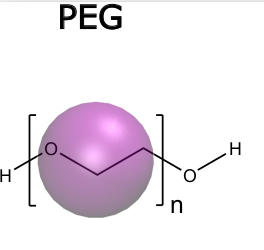

## LAMMPS simulations of a single PEG molecule (CG model)

The objective is the parametrization of the PEG model, by changing the $\epsilon$ parameter of the LJ potential and comparing the obtained Rg with the values reported in the literature.

The files included here are the following:
### PEG coordinates:
- data_generator.py: a python file that generates a very simple PEG chain
- data.start: coordinates of a PEG file generated by the python file
### Energy minimization:
- input_XXX_minimization.txt: example of input file for energy minimization a single PEG
- minimized.data: minimum energy structure of a PEG polymer
### MD Simulation and analysis
- input_XXX_melt.txt: example of input files for running  a simulation of a single PEG
- radi_gir.tcl: VMD analysis script in tcl to calculate the radius of gyration from the output of the LAMMPS simulation

